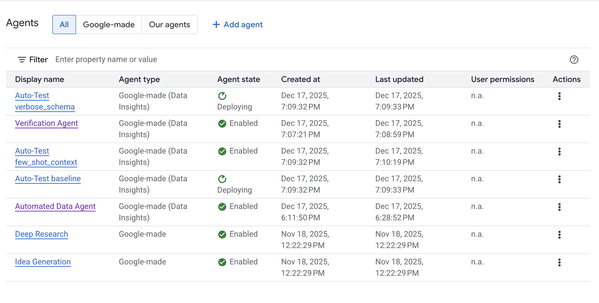

# Data Insights Agent (DIA) Testing Harness

A comprehensive test harness for deploying, verifying, and benchmarking Google Cloud Data Insights Agents (DIA) in parallel. This tool allows you to validate agent configurations, test data routing, and measure performance using golden datasets.



## Features

- **Multi-Variant Deployment**: Deploys 5 distinct agent configurations in parallel (Baseline, Few-Shot, Verbose Schema, Persona, Chain-of-Thought).
- **Dynamic Authorization**: Automatically creates and links Authorization Resources with specific OAuth scopes and BigQuery access.
- **Robust Configuration**: Uses "Delete-and-Recreate" strategy to ensure clean state and correct authorization for every deployment.
- **Data Generation**: Scripts to generate synthetic E-commerce datasets (Customers, Products, Orders) and Golden Test Sets.
- **Reporting**: Automatic results capture in `results.json` (currently pending API connectivity for automated probing).

## Prerequisites

- Python 3.9+
- `uv` (recommended build tool) or `pip`
- Google Cloud Project with Discovery Engine API enabled
- `gcloud` CLI authenticated
- **OAuth Resource**: You must create an OAuth client and secret for the agent to access BigQuery.
  - Follow the guide to [Create Authorization Resource](https://docs.cloud.google.com/gemini/enterprise/docs/data-agent#auth-details).

## Installation

1. **Clone the repository**:
   ```bash
   git clone <repo-url>
   cd dia_test_harness_gemini_enterprise
   ```

2. **Initialize Environment**:
   ```bash
   uv venv
   source .venv/bin/activate
   uv pip install -e .
   ```

3. **Configure Environment Variables**:
   Copy the example environment file:
   ```bash
   cp .env.example .env
   ```
   Edit `.env` with your project details:
   ```env
   GOOGLE_CLOUD_PROJECT=your-project-id
   DIA_LOCATION=global
   DIA_ENGINE_ID=your-engine-id
   BQ_DATASET_ID=dia_test_dataset
   OAUTH_CLIENT_ID=your-oauth-client-id
   OAUTH_SECRET=your-oauth-client-secret
   ```
   > **Note**: For all available configuration options, refer to the [Data Agent Documentation](https://docs.cloud.google.com/gemini/enterprise/docs/data-agent).

## Usage

### 1. Generate Data in BigQuery

Load synthetic data into your BigQuery dataset:
```bash
python scripts/load_to_bq.py
```

### 2. Deploy Agents (Multi-Variant)

The harness is configured to deploy 5 parallel agent variants defined in `configs/multi_variant.json`.

**Variants:**
1.  `baseline`: Standard prompt.
2.  `few_shot_context`: Included Q&A examples.
3.  `verbose_schema`: Detailed schema description.
4.  `persona_business`: BI Analyst persona.
5.  `cot_reasoning`: Chain-of-Thought instructions.

**Run Deployment:**
```bash
python scripts/deploy_data_agent.py
```
> **Note**: This script will automatically **delete** any existing agents with the same display names (`Data Agent - <variant>`) before creating new ones. This ensures the latest Authorization keys and configurations are applied.

### 3. Verification (Manual)

> [!WARNING]
> **Automated Probing Unavailable**: Due to current `v1alpha` API limitations, the test harness cannot programmatically probe the authenticated agents.

**Manual Verification Steps:**
1.  Go to the [Google Cloud Console > Agent Builder](https://console.cloud.google.com/gen-app-builder/engines).
2.  Select your Engine (`DIA_ENGINE_ID`).
3.  Navigate to **Agents**.
4.  You will see 5 agents corresponding to the deployed variants.
5.  Test each agent manually in the Console's "Preview" pane to verify it can query BigQuery and answer questions according to its specific persona/configuration.

## Project Structure

```
.
├── configs/                 # Agent configuration JSONs
│   ├── multi_variant.json   # Main 5-variant config
│   └── sample_configs.json
├── data/                    # Generated data and golden sets
├── scripts/                 # Utility and Deployment scripts
│   ├── check_env.py
│   ├── check_lro.py         # Monitor Liquid Operations
│   ├── create_dummy_datastore.py
│   ├── deploy_data_agent.py # Main deployment script
│   ├── generate_data.py
│   ├── generate_golden_set.py
│   ├── inspect_*.py         # Configuration inspection tools
│   ├── load_to_bq.py
│   ├── probe_data_agent.py  # Automated probing (pending API fix)
│   └── verify_connectivity.py
├── src/
│   └── orchestrator/        # Core harness logic
├── results.json             # Test run outputs
├── pyproject.toml           # Project dependencies
└── README.md
```

## Known Issues

- **API Connectivity**: Automated testing via `probe_data_agent.py` is currently blocked by API authentication limitations for `v1alpha` agents.
- **Search Dominance**: Implicit routing may favor Search over SQL generation for generic queries.
